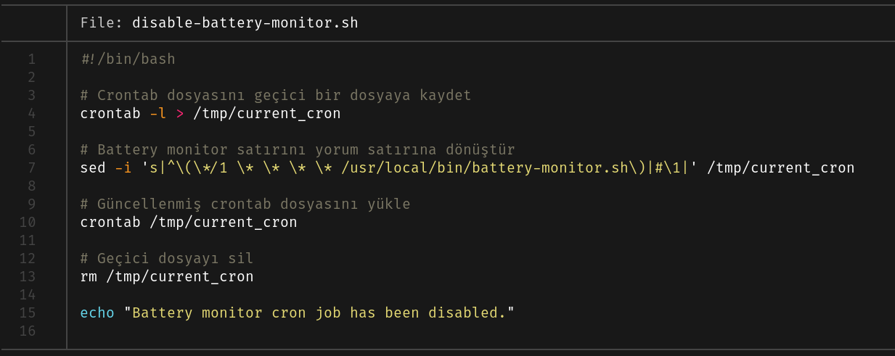
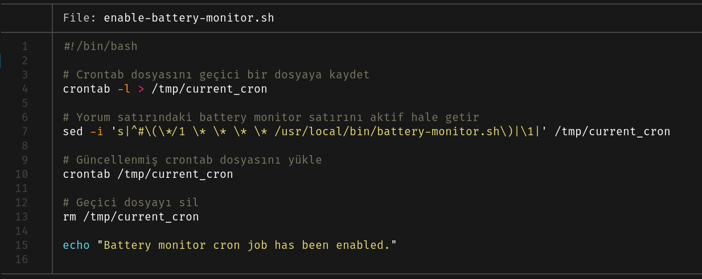

<p align="center">
   <br/>
The bash script monitors battery status and sends a notification if the battery level is above 80% while charging, and plays an audio alert. It also provides a low battery warning with audio when the level drops below 54%.
</p>


### crontab

```
*/1 * * * * /usr/local/bin/battery-monitor.sh
```

### Battery Monitor Enable/Disable Scripts

This repository includes two scripts to manage the battery monitor cron job:

- `disable-battery-monitor.sh`: Comments out the battery monitor cron job.
- `enable-battery-monitor.sh`: Uncomments the battery monitor cron job.





